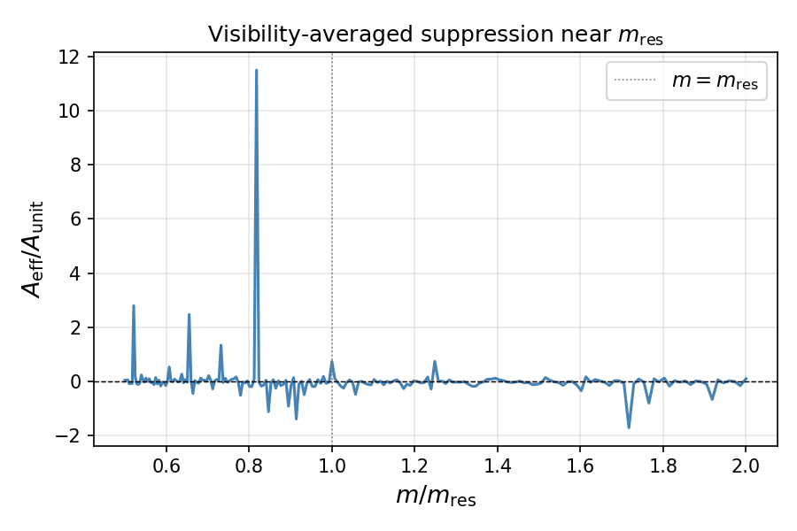
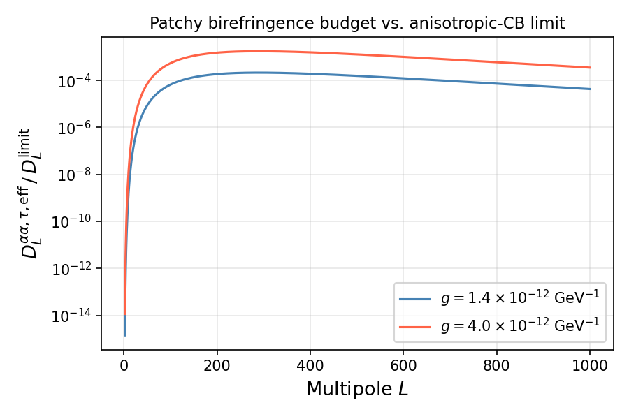

# A Methodological Note on Interpreting Anisotropic Cosmic Birefringence Constraints in the Presence of Patchy Reionization

## Abstract

Current constraints on anisotropic cosmic birefringence are often interpreted as limits on the genuine ALP-induced fluctuation term alone. In this note we revisit that assumption in the presence of an effective patchy-reionization contribution. The observable anisotropic birefringence power spectrum is a sum of contributions, not a single component. Therefore, observational limits should in general be read as constraints on the total birefringence power, rather than on $C_L^{\phi\phi}$ alone [1,2].

To quantify this effect, we compare a reference thin-shell estimate with matched natural-unit and visibility-weighted calculations. The reference thin-shell calculation uses a simple surrogate template for $C_L^{\tau\tau}$ and isolates the local ALP time-derivative response at reionization. In that limit, the patchy contribution can reach the percent-to-ten-percent level of current anisotropic-CB limits for benchmark couplings. However, once finite-width visibility averaging is included, the thin-shell preferred mass point is strongly suppressed. The physically relevant mass window moves toward the resonance scale $m_{\rm res} \sim 10^{-29}\,{\rm eV}$, where oscillatory structure remains, but in the current surrogate setup the observable patchy signal stays below the present anisotropic-CB limit by a substantial margin. Even optimistic rescalings of the surrogate template normalization only lift the signal to at most the few-percent level for the larger benchmark coupling.

The main conclusion is therefore methodological rather than discovery-driven. Formally, anisotropic-CB constraints apply to the total birefringence power. In the visibility-weighted surrogate calculation studied here, however, the patchy-induced term remains small enough that the usual interpretation as a constraint on the genuine ALP fluctuation term is not significantly altered for current data.

## 1. Motivation

Patchy reionization induces an effective anisotropic birefringence term by modulating the effective photon emission time. Whether this term is phenomenologically important depends on the ALP time derivative during reionization and on how that time-dependent response averages across the finite thickness of the visibility function. A thin-shell treatment is a useful first diagnostic because it evaluates the ALP time derivative at a single effective reionization time. This isolates the response coefficient that converts optical-depth fluctuations into birefringence fluctuations, and it makes clear where the mass dependence of the effect enters.

There is a simple reason to expect the effect to be small: patchy reionization is a secondary modulation, and optical-depth fluctuations are themselves limited in amplitude. However, that naive expectation is not by itself decisive. If the characteristic bubble scale is comparable to the ALP oscillation scale during reionization, the line-of-sight response can sample the ALP phase coherently rather than averaging it away. This scale-matching possibility motivates an explicit calculation rather than assuming from the outset that the patchy contribution is negligible.

The observable quantity, however, is not the local thin-shell response itself. What matters is the visibility-weighted response after integrating across the finite thickness of reionization. The calculation therefore has two logically distinct roles: the thin-shell limit identifies the potentially relevant mass scales, while the finite-width calculation determines how much of that response survives in an observable birefringence spectrum. This leads to three questions:

- What is actually constrained by current anisotropic-CB limits?
- How much of the reference thin-shell signal survives finite-width averaging?
- Is the patchy-induced effective term large enough to invalidate the usual interpretation of current limits as constraints on the genuine ALP term?

## 2. Decomposition of the Birefringence Signal

The anisotropic birefringence field is decomposed as

```math
\delta\alpha(\hat n)=\delta\alpha_\phi(\hat n)+\delta\alpha_\tau(\hat n),
```

where

```math
\delta\alpha_\phi(\hat n)
=
-\frac{g_{a\gamma}}{2}\,
\delta\phi(\bar\eta_{\rm emit}, \chi_{\rm emit}\hat n)
```

is the genuine ALP fluctuation term, and

```math
\delta\alpha_\tau(\hat n)
=
-\frac{g_{a\gamma}}{2}\,
\dot{\bar\phi}(\bar\eta_{\rm emit})
\frac{d\eta}{d\tau}\,
\delta\tau(\hat n)
```

is the effective patchy term induced by fluctuations in the optical-depth field.

The angular power spectrum therefore becomes

```math
C_L^{\alpha\alpha}
=
A_\phi^2 C_L^{\phi\phi}
+
A_\tau^2 C_L^{\tau\tau}
+
2 A_\phi A_\tau C_L^{\phi\tau}.
```

If $C_L^{\phi\tau}$ is neglected, observational constraints apply to

```math
A_\phi^2 C_L^{\phi\phi} + A_\tau^2 C_L^{\tau\tau},
```

not to $A_\phi^2 C_L^{\phi\phi}$ by itself. This is the central interpretational point.

## 3. Results

### 3.1 Reference thin-shell estimate

The first stage of the calculation used a simple surrogate template for $C_L^{\tau\tau}$ together with a thin-shell approximation for reionization. This was not intended as a final prediction for the observable signal. Its purpose was to estimate the local response

```math
A_{\rm unit}(m_a)
=
\left[
\dot\phi_{\rm conf}\frac{d\eta}{d\tau}
\right]_{\phi_{\rm ini}=1}
```

and to identify the mass range where the patchy-induced contribution is most efficient before visibility averaging is applied. In this reference calculation, the preferred mass around

```math
m_{\rm best} \simeq 5.878016\times10^{-27}\,{\rm eV}
```

gave a strong unit-response signal. In natural units, this translated into a patchy contribution at roughly the 1–10% level of current anisotropic-CB limits for the benchmark couplings

```math
g_{a\gamma} = 1.4\times10^{-12}\ {\rm GeV}^{-1},
\qquad
4.0\times10^{-12}\ {\rm GeV}^{-1}.
```

These results serve as a reference scale for the response, but they should be understood as thin-shell estimates rather than visibility-averaged predictions. The coupling benchmarks are motivated by cluster/X-ray bounds in the ultra-light mass regime [4].

### 3.2 Finite-width visibility averaging

The crucial correction came from directly computing a visibility-weighted effective response $A_{\rm eff}$. Once this was done, the thin-shell preferred point was found to be strongly suppressed:

```math
\left.\frac{A_{\rm eff}}{A_{\rm unit}}\right|_{m_{\rm best}}
\simeq 0.0148.
```

This means that the thin-shell estimate at $m_{\rm best}$ is not stable under finite-width averaging.

At the resonance-scale mass

```math
m_{\rm res} = 1.023963\times10^{-29}\,{\rm eV},
```

the suppression is much weaker,

```math
\left.\frac{A_{\rm eff}}{A_{\rm unit}}\right|_{m_{\rm res}}
\simeq 0.734,
```

and the physically interesting window shifts toward the $m_{\rm res}$ region. A finer scan (201 points) showed that the response there is oscillatory and sign-changing as a function of mass, because the ALP oscillation phase at reionization shifts continuously with $m_a$. The current best point appears near $m/m_{\rm res} \simeq 0.895$.

Here $m_{\rm res}$ is defined using the fiducial characteristic bubble scale in the surrogate template. Changing the effective bubble radius would shift the scale-matching mass, so the numerical value above should be read as the resonance location for the fiducial template rather than as a universal mass. In the visibility-weighted scan used for the budget below, the bubble scale is kept fixed and the ALP mass is varied around this fiducial $m_{\rm res}$.



*Figure 1. Visibility-averaged suppression factor $A_{\rm eff}/A_{\rm unit}$ as a function of $m/m_{\rm res}$ from the 201-point fine scan. The response is oscillatory and sign-changing. The vertical dotted line marks $m = m_{\rm res}$. The thin-shell limit corresponds to $A_{\rm eff}/A_{\rm unit} = 1$.*

### 3.3 Current observable impact

Using the visibility-weighted natural-unit pipeline, the current best patchy contribution remains well below the current anisotropic-CB limit:

- about $2.15\times10^{-4}$ of the anisotropic-CB limit for $g_{a\gamma}=1.4\times10^{-12}\,{\rm GeV}^{-1}$
- about $1.75\times10^{-3}$ of the anisotropic-CB limit for $g_{a\gamma}=4.0\times10^{-12}\,{\rm GeV}^{-1}$

This already indicates that the finite-width effect is not a minor correction: it qualitatively changes the phenomenological conclusion drawn from the reference thin-shell estimate.



*Figure 2. Ratio $D_L^{\alpha\alpha,\tau,{\rm eff}} / D_L^{\rm limit}$ as a function of multipole $L$ at the best visibility-weighted mass ($m \simeq 9.16\times10^{-30}$ eV, $m/m_{\rm res} \simeq 0.895$), for both benchmark couplings. Even at the peak multipole $L \simeq 289$, the patchy contribution is below the current anisotropic-CB limit by roughly three orders of magnitude.*

## 4. Normalization Sensitivity

The remaining major uncertainty is the normalization of the surrogate $C_L^{\tau\tau}$ template. To quantify this, we asked how much the template normalization would need to be boosted in order to raise the patchy contribution to selected fractions of the current anisotropic-CB limit. The surrogate family itself was inspired by the Dvorkin-Smith patchy-reionization framework [3].

The template also contains a characteristic bubble scale, represented by an effective radius $R_{\rm eff}$, which sets the approximate peak multipole through $L_{\rm peak}\sim \chi(z_{\rm re})/R_{\rm eff}$. In this note the visibility-weighted budget is evaluated at the fiducial scale corresponding to $(\bar R,\sigma_{\ln R})=(5.0,0.693)$, giving $R_{\rm eff}\simeq 34.1$ Mpc and $L_{\rm peak}\simeq 289$. We estimated how the scale-matching mass would move for a plausible range of $R_{\rm eff}$, but the budget calculation itself is not a full joint scan over bubble size, template normalization, and ALP mass.

For the current best visibility-weighted point, the required boosts are:

- low-$g$ benchmark:
  - about $4.66\times10^1$ to reach 1%
  - about $4.66\times10^2$ to reach 10%
- high-$g$ benchmark:
  - about $5.70$ to reach 1%
  - about $5.70\times10^1$ to reach 10%

We also tested steeper Dvorkin-Smith-inspired amplitude scalings of the form

```math
D_{\rm peak} \propto (A/A_{\rm fid})^{p_{\rm amp}} (b/b_{\rm fid})^{p_b}
```

with $p_{\rm amp}, p_b \le 3$. Within the parameter range explored here, the maximum available boost was only

```math
{\rm max\ boost} \simeq 3.27\times10^1.
```

Combining this with the current best visibility-weighted budget gives an optimistic best-case estimate of

- about $7.0\times10^{-3}$ for the low-$g$ benchmark
- about $5.7\times10^{-2}$ for the high-$g$ benchmark

as fractions of the current anisotropic-CB limit.

Thus, even after fairly aggressive internal rescaling of the surrogate family, the patchy term remains below the current limit in this setup. The high-coupling benchmark can reach the few-percent level under optimistic rescaling, so the effect is not mathematically absent, but it does not dominate the present anisotropic-CB budget.

## 5. Methodological Implication

The main implication of this analysis is not that current anisotropic-CB limits must be substantially reinterpreted, but rather that the standard interpretation can be checked within a total-power framework.

1. Formally, constraints on anisotropic cosmic birefringence apply to the total birefringence power.
2. A patchy-induced effective term can in principle contribute to that total, and therefore could reduce the room available for the genuine ALP term.
3. In the visibility-weighted surrogate models studied here, the patchy term remains small enough that the usual current-limit interpretation as a constraint on the genuine ALP fluctuation term is a good approximation.
4. Thin-shell estimates can substantially overstate the relevance of the patchy term.
5. Finite-width visibility averaging is essential for deciding whether the formal total-power caveat has numerical impact.

This is enough to justify a methodological check rather than a strong reinterpretation of existing bounds. One should first assess any patchy contribution with a finite-width treatment; in the present surrogate setup, that assessment supports the conventional reading of current anisotropic-CB limits as effectively constraining the genuine ALP fluctuation term [1,2].

## 6. Conclusion

Under the present surrogate assumptions, the calculation does not support a strong claim that patchy reionization generates a large observable anisotropic-CB signal. It supports a more limited but useful conclusion:

anisotropic-CB constraints are formally constraints on the total birefringence power, but after finite-width visibility averaging the patchy contribution studied here is small enough that current limits can still be interpreted, to good approximation, as constraints on the genuine ALP fluctuation term. The total-power viewpoint remains the correct framework for future higher-precision data or more extreme reionization templates.

## References

1. T. Namikawa, "Reionization-era cosmic birefringence with finite last-scattering thickness," *Phys. Rev. D* **109**, 123521 (2024) [arXiv:2404.13771].
2. A. Lonappan, B. Keating, and K. Arnold, "Constraints on Anisotropic Cosmic Birefringence from CMB B-mode Polarization," arXiv:2504.13154.
3. V. Dvorkin and K. M. Smith, "Reconstructing Patchy Reionization from the Cosmic Microwave Background," *Phys. Rev. D* **79**, 043003 (2009).
4. M. Berg, J. P. Conlon, F. Day, N. Jennings, S. Krippendorf, A. J. Powell, and M. Rummel, "Constraints on Axion-Like Particles from X-ray Observations of NGC1275," *Astrophys. J.* **847**, 101 (2017) [arXiv:1605.01043].
